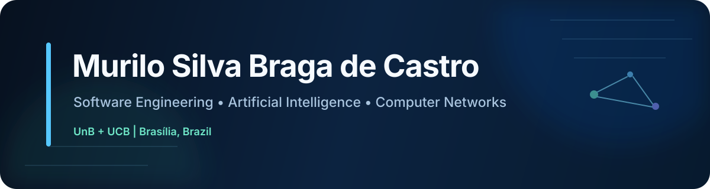

<p align="center">
  
</p>

<p align="center">
  <a href="https://www.linkedin.com/in/murilocastro31/"></a>
  <a href="mailto:murilosbcastro@gmail.com"></a>
  
</p>

## About me

I’m a technology student based in **Brasília, Brazil**, currently pursuing two higher-education programs:

- **Communication Networks Engineering** at **Universidade de Brasília (UnB)** — expected graduation: **2031**
- **Systems Analysis and Development** at **Universidade Católica de Brasília (UCB)** — expected graduation: **2028**

My main interests are **Software Engineering, Artificial Intelligence and Computer Networks**. I enjoy learning through practice: testing ideas, understanding why things fail, correcting mistakes and improving solutions until they work well.

Right now, I’m strengthening my programming fundamentals, learning modern development workflows and preparing to build a portfolio of real-world projects while pursuing my **first internship in technology**.

## Current focus

```text
Software Engineering    → programming fundamentals, full stack development, clean code
Artificial Intelligence → generative AI, LLM workflows, AI-assisted development
Computer Networks       → networking fundamentals, infrastructure and automation
Career                   → first internship in technology
```

## Tech stack

### Languages

<p>
  
</p>

### Web Development

<p>
  
</p>

### Tools & Platforms

<p>
  
</p>

> Technologies listed here are technologies I have already studied or used. I’m actively developing deeper proficiency through coursework and hands-on practice.

## Education

### Universidade de Brasília — UnB
**Communication Networks Engineering**  
2026 — 2031 (expected)

Current coursework includes **Computer Programming for Engineering, Calculus I, Physics I, Experimental Physics I and Environmental Sciences**.

### Universidade Católica de Brasília — UCB
**Technology Degree in Systems Analysis and Development**  
2026 — 2028 (expected)

## Additional training

### FullStack PRO — Sujeito Programador
**In progress — started Jan 2026**

Training focused on modern full stack development, covering front-end, back-end and AI-assisted software development.

## Certification

- **Claude Academy: Claude 101 — Anthropic** — 2026

## Technical roadmap

These are the projects and technical areas I plan to develop as my portfolio grows:

| Project / Track | Goal | Planned stack |
|---|---|---|
| **NetDiag** | Network diagnostics and automation | Python, networking, CLI |
| **Full Stack Application** | End-to-end web application | React / Next.js, Node.js, database |
| **NetOps AI** | AI-assisted network and infrastructure analysis | Python / TypeScript, LLM API, full stack |
| **Algorithms & Data Structures** | Problem solving and interview fundamentals | Python / C++ |

> This section is a roadmap, not a list of completed projects. Finished projects will be linked here as they are published.

## What I’m learning next

- Git and collaborative development workflows
- SQL and relational databases
- REST APIs and HTTP fundamentals
- Data structures and algorithms
- Linux and command-line tooling
- TCP/IP, DNS, routing, switching and network fundamentals
- Building and documenting production-style projects

## Languages

- **Portuguese:** Native
- **English:** Intermediate
- **Spanish:** Intermediate

## Let’s connect

I’m looking for my **first technology internship**, preferably remote, while remaining open to on-site opportunities.

If you work with **software engineering, AI, networking, infrastructure or technology recruiting**, feel free to reach out.

<p align="center">
  <a href="https://www.linkedin.com/in/murilocastro31/"><strong>LinkedIn</strong></a>
  ·
  <a href="mailto:murilosbcastro@gmail.com"><strong>Email</strong></a>
</p>
